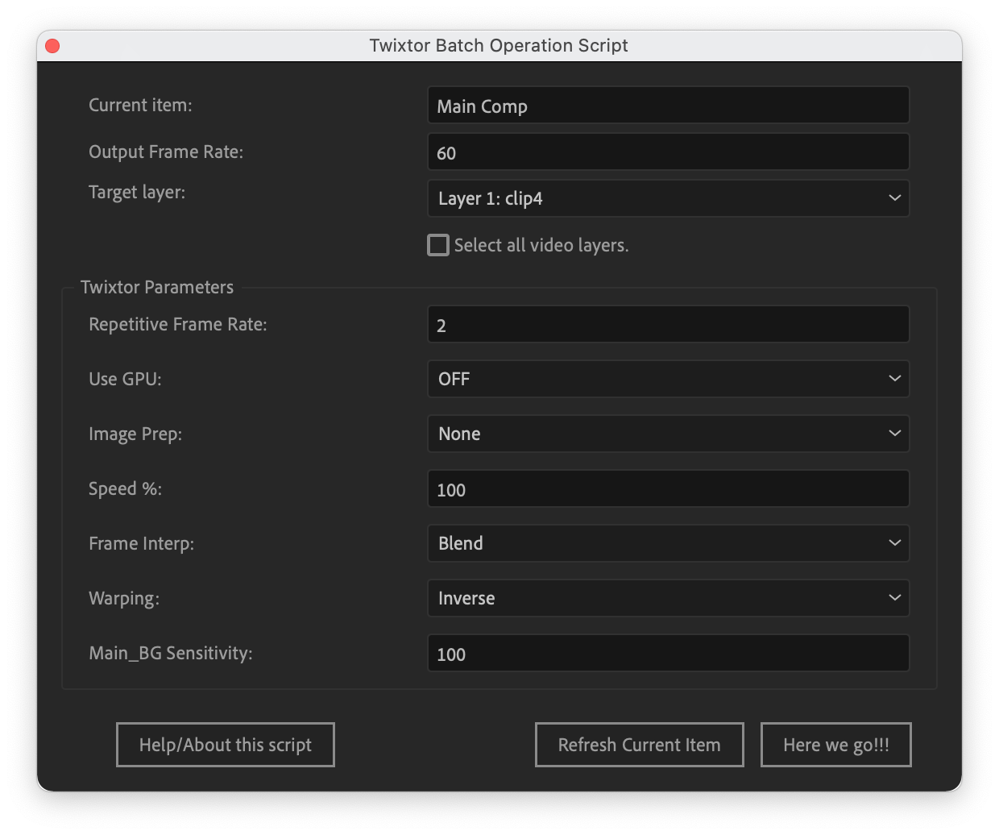

[English](README.md) | 中文

# Twixtor批量操作辅助脚本
本脚本适用于Adobe After Effects，其帮助使用者添加[Twixtor插件](https://revisionfx.com/products/twixtor/)特效于选定合成中的选定视频素材层或所有视频素材层以制作无极慢放视频或者补帧向视频。此处，视频素材层特指可以添加twixtor特效的原视频素材剪辑层或者包含视频轨道的合成层，因此固态层等会自动被脚本跳过。

本脚本会包揽从两次预合成，添加twixtor特效，到最终生成一个用于添加时间重映变速的新合成（时间重映快捷键：Ctrl+Alt+T）。您唯一要做的就是一次点击：**一键生成整个工程合成框架！**

作为最初的设计目的，本脚本适合AMV作者使用。关于twixtor的教程可以很容易在b站和油管上找到，所以如果您还不知道twixtor是什么，请自行查阅资料。

<br>
脚本运行截图。

***Repetitive Frame Rate***（重复帧率）指的是每个独特场景会持续几帧，俗称一拍几。举个例子，对于一个24fps动漫视频，这个值通常是2（一拍二）或3（一拍三），即每幅原画会持续2到3帧，所以视频中的每秒24帧需要24/2=12或者24/3=8幅原画。对于其他三次元拍摄的视频，这个重复率通常是1。脚本需要通过这个值来修改twixtor的输入帧率参数（Input: Frame Rate），从而去除重复帧。

# 安装
请将```.jsx```脚本文件放置于

* :open_file_folder: ```<Ae安装文件夹>/support file/script/```

或者

* :open_file_folder: ```<Ae安装文件夹>/support file/script/ScriptUI Panels/```

然后重启Ae后，在以下菜单栏中找到并运行

* <kbd>file</kbd>><kbd>scripts</kbd>><kbd>twixtor-batch-operation-script.jsx</kbd> 

或者

* <kbd>window</kbd>><kbd>twixtor-batch-operation-script.jsx</kbd>

# 依赖兼容
* Adobe After Effects cc 2020 及以上。
* Twixtor插件（本脚本使用Twixtor Pro）。
* 请支持正版。